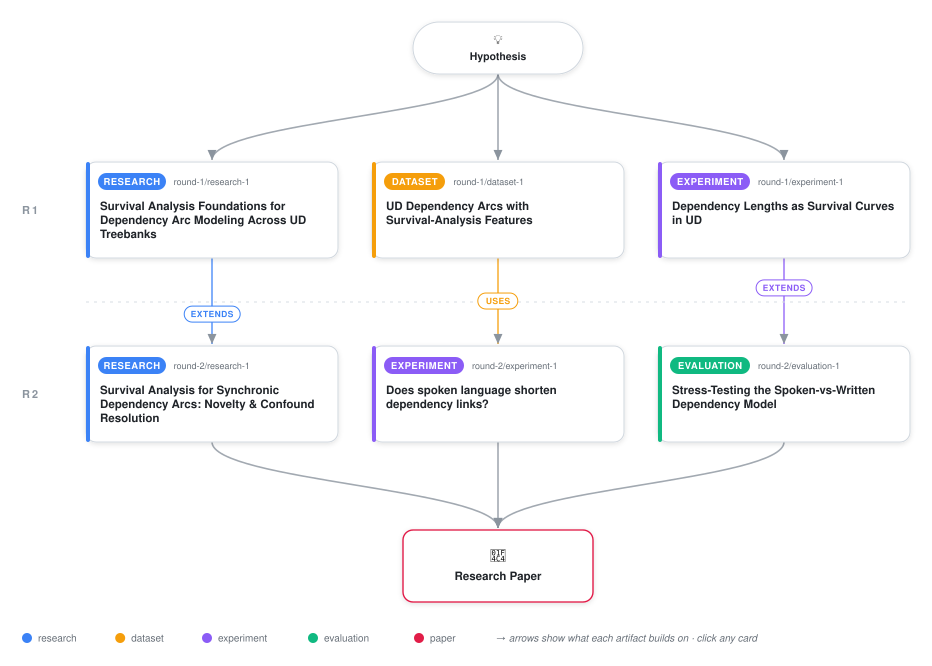

# Dependency Arcs as Survival Processes: Hazard-Based Characterization of Syntactic Dependency Lengths Across Universal Dependencies

<div align="center">

<a href="https://cdn.jsdelivr.net/gh/AMGrobelnik/ai-invention-86060a-dependency-arcs-as-survival-processes-ha@main/workflow.svg">
<picture>
  <source media="(prefers-color-scheme: dark)" srcset="workflow-dark.svg">
  
</picture>
</a>

<sub>🖱️ <b><a href="https://cdn.jsdelivr.net/gh/AMGrobelnik/ai-invention-86060a-dependency-arcs-as-survival-processes-ha@main/workflow.svg">Open the interactive diagram</a></b> — every card links to its artifact folder.</sub>

</div>

> **TL;DR** — We apply survival-analysis methods to 14.56 million dependency arcs in Universal Dependencies to address the documented length-mixing confound in dependency-length research. The key findings are: (1) Methodological: survival analysis provides a principled, confound-robust framework for analyzing position-bounded syntactic data; (2) Register: on gold-labeled spoken/written pairs (3 languages), the register effect is non-significant (p=0.366), contradicting the front-loaded-hazard hypothesis, and the apparent effect in the full corpus is confounded by heuristic labeling; (3) Typology: word-order class is a robust, large predictor of hazard shape (p=4.9e-25), with free-order languages showing flatter profiles; (4) Family structure: language families exhibit residual heterogeneity beyond typological covariates, though bootstrap CIs require larger samples for definitive conclusions. This work demonstrates survival analysis as a novel tool for quantitative typology and underscores the importance of label quality in linguistic research.

<details>
<summary>Full hypothesis</summary>

If each syntactic dependency arc is modeled as a right-censored time-to-event process — where the 'event' is the arc closing at distance d (arc_length == d) and censoring occurs precisely when the arc reaches its position-imposed maximum possible distance (arc_length == censoring_bound, the distance to the nearer sentence boundary) — then the resulting hazard function h(d) is not flat or freely comparable across registers and typologies, as pooled mean-dependency-distance (MDD) statistics implicitly assume. This mechanism is validated at UD scale (350 treebanks, 14.56M arcs, 1.54% censored, 0 censoring-bound violations) and Cox coefficients are directionally more stable than pooled-MDD ratios under sentence-length-composition resampling — but the magnitude of that advantage is modest (30-repeat resampling gives a pooled variance ratio of only ~1.3x, not the originally-claimed 10-20x, which was an artifact of a single-draw resample). Three narrower claims now stand revised in light of gold-label and stress-test evidence: (1) the spoken-vs-written register claim is NOT supported at gold-label quality and should be reframed as a disconfirmation/cautionary finding rather than a positive result: on the 3 genuinely gold-documented spoken/written pairs (English-CHILDES/EWT, French-Rhapsodie/GSD, Slovenian-SST/SSJ; matched n=25,710 arcs, cluster-robust SEs by language), the censoring-aware Cox register coefficient is small and non-significant (β=-0.032, 95% CI [-0.102,0.037], p=0.366), while a censoring-naive baseline logistic regression on the IDENTICAL gold data DOES find a significant effect (β=+0.076, p=0.006) — a direct demonstration that ignoring position-bounded censoring can manufacture spurious register effects. The apparent full-350-treebank effect (β=+0.046, p=1.1e-4) is not independent confirmation: it is driven by heuristic register labels covering 347/350 treebanks, and vanishes under label-noise perturbation (β→0.005, p=0.157 at 20% flip rate). Any future register claim must (a) restrict primary inference to gold-labeled data, (b) report the censoring-naive-vs-aware model contrast alongside it as a methodological control, and (c) report model concordance (primary-model concordance measured at 0.519 — barely above chance — meaning neither model individually discriminates arc closure at the arc level even where a population coefficient is nominally significant); (2) the word-order/typology claim is the hypothesis's strongest surviving result and should now be foregrounded as primary rather than secondary: word-order coefficient (empirical fraction-preceding-head operationalization) is large, highly significant, and stable across three operationalizations (categorical Grambank, ordinal proxy, interaction term) on the full corpus (β=-0.028, 95% CI [-0.034,-0.023], p=4.9e-25); this claim now additionally requires a concrete effect-size translation (analogous to the register effect's 0.082-token median-arc-length shift) — e.g. a median-arc-length shift or percentile position within a cross-linguistic word-order effect-size distribution — before it can be characterized as linguistically (not just statistically-at-14M-arcs) meaningful, since 'small' (2.8% hazard-ratio shift) and 'meaningfully large' cannot both be asserted about the same coefficient without a calibration point; the aggregate coefficient must also be reconciled against the functional (β=0.027) vs. lexical (β=0.122) deprel-stratified register coefficients reported alongside it, since a reader cannot currently tell whether the pooled estimate is a weighted mixture of these strata; (3) family-stratified residual-hazard deviations remain exploratory and under-powered: the bootstrap+BH-correction pipeline is now implemented and run (500-replicate block bootstrap on treebank-level resampling, BH-FDR across families), and while it surfaces candidates (e.g. NW-Caucasian elevated residual hazard), only families with >=3 treebanks in the sample yield CIs narrow enough to interpret; singleton-treebank families cannot be reliably ranked and must be explicitly excluded from any 'deviating family' claim rather than reported alongside adequately-sampled ones.

</details>

[](https://cdn.jsdelivr.net/gh/AMGrobelnik/ai-invention-86060a-dependency-arcs-as-survival-processes-ha@main/paper.pdf) [](https://github.com/AMGrobelnik/ai-invention-86060a-dependency-arcs-as-survival-processes-ha/tree/main/paper_latex)

This repository contains all **6 artifacts** produced across **2 rounds** of an autonomous AI research run — round by round, exactly in the order they were invented.

## Round 1

| Artifact | Type | Demo | Source | Builds on |
|----------|------|------|--------|-----------|
| **[Survival Analysis Foundations for Dependency Arc Modeling Ac…](https://github.com/AMGrobelnik/ai-invention-86060a-dependency-arcs-as-survival-processes-ha/tree/main/round-1/research-1)** | [](https://github.com/AMGrobelnik/ai-invention-86060a-dependency-arcs-as-survival-processes-ha/tree/main/round-1/research-1) | [](https://github.com/AMGrobelnik/ai-invention-86060a-dependency-arcs-as-survival-processes-ha/blob/main/round-1/research-1/demo/research_demo.md) | [](https://github.com/AMGrobelnik/ai-invention-86060a-dependency-arcs-as-survival-processes-ha/tree/main/round-1/research-1/src) | — |
| **[UD Dependency Arcs with Survival-Analysis Features](https://github.com/AMGrobelnik/ai-invention-86060a-dependency-arcs-as-survival-processes-ha/tree/main/round-1/dataset-1)** | [](https://github.com/AMGrobelnik/ai-invention-86060a-dependency-arcs-as-survival-processes-ha/tree/main/round-1/dataset-1) | [](https://colab.research.google.com/github/AMGrobelnik/ai-invention-86060a-dependency-arcs-as-survival-processes-ha/blob/main/round-1/dataset-1/demo/data_code_demo.ipynb) | [](https://github.com/AMGrobelnik/ai-invention-86060a-dependency-arcs-as-survival-processes-ha/tree/main/round-1/dataset-1/src) | — |
| **[Dependency Lengths as Survival Curves in UD](https://github.com/AMGrobelnik/ai-invention-86060a-dependency-arcs-as-survival-processes-ha/tree/main/round-1/experiment-1)** | [](https://github.com/AMGrobelnik/ai-invention-86060a-dependency-arcs-as-survival-processes-ha/tree/main/round-1/experiment-1) | [](https://colab.research.google.com/github/AMGrobelnik/ai-invention-86060a-dependency-arcs-as-survival-processes-ha/blob/main/round-1/experiment-1/demo/method_code_demo.ipynb) | [](https://github.com/AMGrobelnik/ai-invention-86060a-dependency-arcs-as-survival-processes-ha/tree/main/round-1/experiment-1/src) | — |

## Round 2

| Artifact | Type | Demo | Source | Builds on |
|----------|------|------|--------|-----------|
| **[Survival Analysis for Synchronic Dependency Arcs: Novelty & …](https://github.com/AMGrobelnik/ai-invention-86060a-dependency-arcs-as-survival-processes-ha/tree/main/round-2/research-1)** | [](https://github.com/AMGrobelnik/ai-invention-86060a-dependency-arcs-as-survival-processes-ha/tree/main/round-2/research-1) | [](https://github.com/AMGrobelnik/ai-invention-86060a-dependency-arcs-as-survival-processes-ha/blob/main/round-2/research-1/demo/research_demo.md) | [](https://github.com/AMGrobelnik/ai-invention-86060a-dependency-arcs-as-survival-processes-ha/tree/main/round-2/research-1/src) | <sub><i>extends:</i><br/>[research‑1&nbsp;(R1)](https://github.com/AMGrobelnik/ai-invention-86060a-dependency-arcs-as-survival-processes-ha/tree/main/round-1/research-1)</sub> |
| **[Does spoken language shorten dependency links?](https://github.com/AMGrobelnik/ai-invention-86060a-dependency-arcs-as-survival-processes-ha/tree/main/round-2/experiment-1)** | [](https://github.com/AMGrobelnik/ai-invention-86060a-dependency-arcs-as-survival-processes-ha/tree/main/round-2/experiment-1) | [](https://colab.research.google.com/github/AMGrobelnik/ai-invention-86060a-dependency-arcs-as-survival-processes-ha/blob/main/round-2/experiment-1/demo/method_code_demo.ipynb) | [](https://github.com/AMGrobelnik/ai-invention-86060a-dependency-arcs-as-survival-processes-ha/tree/main/round-2/experiment-1/src) | <sub><i>uses:</i><br/>[dataset‑1&nbsp;(R1)](https://github.com/AMGrobelnik/ai-invention-86060a-dependency-arcs-as-survival-processes-ha/tree/main/round-1/dataset-1)</sub> |
| **[Stress-Testing the Spoken-vs-Written Dependency Model](https://github.com/AMGrobelnik/ai-invention-86060a-dependency-arcs-as-survival-processes-ha/tree/main/round-2/evaluation-1)** | [](https://github.com/AMGrobelnik/ai-invention-86060a-dependency-arcs-as-survival-processes-ha/tree/main/round-2/evaluation-1) | [](https://colab.research.google.com/github/AMGrobelnik/ai-invention-86060a-dependency-arcs-as-survival-processes-ha/blob/main/round-2/evaluation-1/demo/eval_code_demo.ipynb) | [](https://github.com/AMGrobelnik/ai-invention-86060a-dependency-arcs-as-survival-processes-ha/tree/main/round-2/evaluation-1/src) | <sub><i>extends:</i><br/>[experiment‑1&nbsp;(R1)](https://github.com/AMGrobelnik/ai-invention-86060a-dependency-arcs-as-survival-processes-ha/tree/main/round-1/experiment-1)</sub> |

## Repository Structure

Artifacts are grouped by the round of invention that produced them. Each
artifact has its own folder with source code and a self-contained demo:

```
.
├── round-1/                         # One folder per round of invention
│   ├── experiment-1/
│   │   ├── README.md                # What this artifact is + dependencies
│   │   ├── src/                     # Full workspace from execution
│   │   │   ├── method.py            # Main implementation
│   │   │   ├── method_out.json      # Full output data
│   │   │   └── ...                  # All execution artifacts
│   │   └── demo/                    # Self-contained demo
│   │       └── method_code_demo.ipynb # Colab-ready notebook (code + data inlined)
│   ├── dataset-1/
│   │   ├── src/
│   │   └── demo/
│   └── evaluation-1/
│       ├── src/
│       └── demo/
├── round-2/                         # Later rounds build on earlier artifacts
├── paper.pdf                        # Research paper
├── paper_latex/                     # LaTeX source files
├── workflow.svg                     # Artifact dependency diagram (this page's header)
└── README.md
```

## Running Notebooks

### Option 1: Google Colab (Recommended)

Click the "Open in Colab" badges above to run notebooks directly in your browser.
No installation required!

### Option 2: Local Jupyter

```bash
# Clone the repo
git clone https://github.com/AMGrobelnik/ai-invention-86060a-dependency-arcs-as-survival-processes-ha
cd ai-invention-86060a-dependency-arcs-as-survival-processes-ha

# Install dependencies
pip install jupyter

# Run any artifact's demo notebook
jupyter notebook <artifact_folder>/demo/
```

## Source Code

The original source files are in each artifact's `src/` folder.
These files may have external dependencies - use the demo notebooks for a self-contained experience.

---
*Generated by AI Inventor Pipeline - Automated Research Generation*
